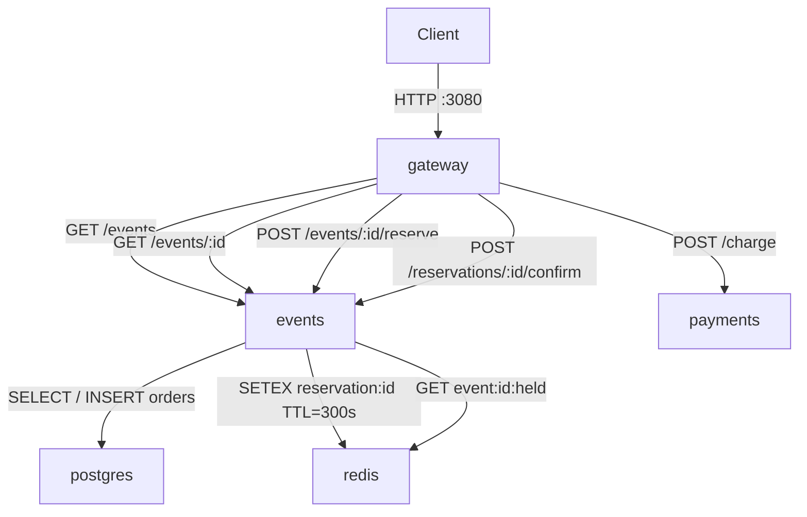

# Lab 1 — SRE Philosophy: Deploy, Break, Understand

**Student:** Rolan  
**Branch:** `feature/lab1`  
**Date:** 2026-06-07

---

## Task 1 — Deploy & Break QuickTicket

### 1.0 — All services up (`docker compose up --build -d`)

```angular2html
[+] Running 8/8                                                                                                                                                                      
 ✔ events                    Built                                                                                                                                              0.0s 
 ✔ gateway                   Built                                                                                                                                              0.0s 
 ✔ payments                  Built                                                                                                                                              0.0s 
 ✔ Container app-redis-1     Healthy                                                                                                                                            1.0s 
 ✔ Container app-gateway-1   Started                                                                                                                                            6.1s 
 ✔ Container app-events-1    Started                                                                                                                                            6.1s 
 ✔ Container app-payments-1  Started                                                                                                                                            0.5s 
 ✔ Container app-postgres-1  Healthy      
```

### 1.1 — All services running (`docker compose ps`)

```
MacBook-Pro-pon4ik:app rolanmulukin$ docker compose ps
NAME             IMAGE                COMMAND                  SERVICE    CREATED              STATUS                        PORTS
app-events-1     app-events           "uvicorn main:app --…"   events     15 seconds ago       Up 8 seconds                  0.0.0.0:8081->8081/tcp
app-gateway-1    app-gateway          "uvicorn main:app --…"   gateway    14 seconds ago       Up 8 seconds                  0.0.0.0:3080->8080/tcp
app-payments-1   app-payments         "uvicorn main:app --…"   payments   15 seconds ago       Up 13 seconds                 0.0.0.0:8082->8082/tcp
app-postgres-1   postgres:17-alpine   "docker-entrypoint.s…"   postgres   About a minute ago   Up 13 seconds (healthy)       0.0.0.0:5432->5432/tcp
app-redis-1      redis:7-alpine       "docker-entrypoint.s…"   redis      About a minute ago   Up About a minute (healthy)   0.0.0.0:6379->6379/tcp
```

### 1.2 — Critical path output

**List events:**
```json
MacBook-Pro-pon4ik:app rolanmulukin$ curl -s http://localhost:3080/events | python3 -m json.tool
[
    {
        "id": 1,
        "name": "Go Conference 2026",
        "venue": "Main Hall A",
        "date": "2026-09-15T09:00:00+00:00",
        "total_tickets": 100,
        "price_cents": 5000,
        "available": 100
    },
    {
        "id": 4,
        "name": "Python Workshop",
        "venue": "Lab 301",
        "date": "2026-09-22T14:00:00+00:00",
        "total_tickets": 25,
        "price_cents": 2000,
        "available": 25
    },
    {
        "id": 2,
        "name": "SRE Meetup",
        "venue": "Room 204",
        "date": "2026-10-01T18:00:00+00:00",
        "total_tickets": 30,
        "price_cents": 0,
        "available": 30
    },
    {
        "id": 5,
        "name": "Kubernetes Deep Dive",
        "venue": "Auditorium B",
        "date": "2026-10-10T10:00:00+00:00",
        "total_tickets": 80,
        "price_cents": 8000,
        "available": 80
    },
    {
        "id": 3,
        "name": "Cloud Native Summit",
        "venue": "Expo Center",
        "date": "2026-11-20T10:00:00+00:00",
        "total_tickets": 500,
        "price_cents": 15000,
        "available": 500
    }
]
```

**Reserve ticket:**
```json
MacBook-Pro-pon4ik:app rolanmulukin$ curl -s -X POST http://localhost:3080/events/1/reserve \
>   -H "Content-Type: application/json" \
>   -d '{"quantity": 1}' | python3 -m json.tool
{
    "reservation_id": "1cbdbe65-762f-4ee7-ae41-991cdd449986",
    "event_id": 1,
    "quantity": 1,
    "total_cents": 5000,
    "expires_in_seconds": 300
}
```

**Pay for reservation:**
```json
MacBook-Pro-pon4ik:app rolanmulukin$ curl -s -X POST http://localhost:3080/reserve/RESERVATION_ID_HERE/pay | python3 -m json.tool
{
    "detail": "Payment succeeded but confirmation failed \u2014 contact support"
}
```

**Health check (all healthy):**
```json
MacBook-Pro-pon4ik:app rolanmulukin$ curl -s http://localhost:3080/health | python3 -m json.tool
{
    "status": "healthy",
    "checks": {
        "events": "ok",
        "payments": "ok",
        "circuit_payments": "CLOSED"
    }
}
```

### 1.3 — Dependency Map



```
gateway  →  events    →  postgres  (list events, reserve, confirm order)
gateway  →  events    →  redis     (hold reservation for 5 min, check availability)
gateway  →  payments              (charge card via POST /charge)
```

**What happens if a dependency is down:**

| Down | Effect |
|------|--------|
| `payments` | `GET /events` and `POST /reserve` still work. `POST /pay` fails with 502 |
| `events`   | Everything fails — gateway proxies all traffic through events |
| `postgres` | `events` can't list events or confirm orders — full outage |
| `redis`    | Reservations are created but not held (events logs a warning). Available ticket count may be incorrect (double-booking risk) |

### 1.4 — Failure Exploration

Each component was stopped with `docker compose stop <service>`, tested, then restored with `docker compose start <service>` before moving to the next.

---

#### Experiment 1 — Kill `payments`

> `payments` is only involved in the `/pay` step. It has no connection to `events`, `postgres`, or `redis`, so killing it should leave browsing and reserving intact.

```
MacBook-Pro-pon4ik:app rolanmulukin$ docker compose stop payments
 Container app-payments-1  Stopping
 Container app-payments-1  Stopped
```

**List events** → OK

```
MacBook-Pro-pon4ik:app rolanmulukin$ curl -s http://localhost:3080/events | python3 -m json.tool
[
    {
        "id": 1,
        "name": "Go Conference 2026",
        "venue": "Main Hall A",
        "date": "2026-09-15T09:00:00+00:00",
        "total_tickets": 100,
        "price_cents": 5000,
        "available": 100
    },
    ...
]
```

**Reserve** → OK

```
MacBook-Pro-pon4ik:app rolanmulukin$ curl -s -X POST http://localhost:3080/events/1/reserve \
>   -H "Content-Type: application/json" -d '{"quantity": 1}' | python3 -m json.tool
{
    "reservation_id": "708916c1-eb31-4170-b8d4-00180c5d4abd",
    "event_id": 1,
    "quantity": 1,
    "total_cents": 5000,
    "expires_in_seconds": 300
}
```

**Pay** → FAIL 502

```
MacBook-Pro-pon4ik:app rolanmulukin$ curl -s -X POST http://localhost:3080/reserve/708916c1-eb31-4170-b8d4-00180c5d4abd/pay | python3 -m json.tool
{
    "detail": "Payment service unavailable"
}
```

**Health check** → degraded

```
MacBook-Pro-pon4ik:app rolanmulukin$ curl -s http://localhost:3080/health | python3 -m json.tool
{
    "status": "degraded",
    "checks": {
        "events": "ok",
        "payments": "down",
        "circuit_payments": "CLOSED"
    }
}
```

**Observation:** browse + reserve stays fully functional. Only the payment step fails. This is the most isolated failure mode in the system — users can still pick seats, they just can't complete the purchase.

```
MacBook-Pro-pon4ik:app rolanmulukin$ docker compose start payments
 Container app-payments-1  Starting
 Container app-payments-1  Started
```

---

#### Experiment 2 — Kill `events`

> `events` is the central service. Gateway routes list, reserve, and confirm-after-payment all through it. Killing it should cause a near-total outage.

```
MacBook-Pro-pon4ik:app rolanmulukin$ docker compose stop events
 Container app-events-1  Stopping
 Container app-events-1  Stopped
```

**List events** → FAIL 502

```
MacBook-Pro-pon4ik:app rolanmulukin$ curl -s http://localhost:3080/events | python3 -m json.tool
{
    "detail": "Events service unavailable"
}
```

**Reserve** → FAIL 502

```
MacBook-Pro-pon4ik:app rolanmulukin$ curl -s -X POST http://localhost:3080/events/1/reserve \
>   -H "Content-Type: application/json" -d '{"quantity": 1}' | python3 -m json.tool
{
    "detail": "Events service unavailable"
}
```

**Pay** → FAIL 500 (payment goes through, but confirm step calls events → fails)

```
MacBook-Pro-pon4ik:app rolanmulukin$ curl -s -X POST http://localhost:3080/reserve/fake-id/pay | python3 -m json.tool
{
    "detail": "Payment succeeded but confirmation failed — contact support"
}
```

**Health check** → degraded

```
MacBook-Pro-pon4ik:app rolanmulukin$ curl -s http://localhost:3080/health | python3 -m json.tool
{
    "status": "degraded",
    "checks": {
        "events": "down",
        "payments": "ok",
        "circuit_payments": "CLOSED"
    }
}
```

**Observation:** complete user-facing outage. `events` is a single point of failure — it sits between gateway and both databases, and is also called during the payment confirmation step.

```
MacBook-Pro-pon4ik:app rolanmulukin$ docker compose start events
 Container app-events-1  Starting
 Container app-events-1  Started
```

---

#### Experiment 3 — Kill `redis`

> `redis` stores temporary reservations (TTL 300s). `events` falls back gracefully when Redis is unreachable, but reservations won't be held — creating a double-booking risk.

```
MacBook-Pro-pon4ik:app rolanmulukin$ docker compose stop redis
 Container app-redis-1  Stopping
 Container app-redis-1  Stopped
```

**List events** → OK (reads from postgres only)

```
MacBook-Pro-pon4ik:app rolanmulukin$ curl -s http://localhost:3080/events | python3 -m json.tool
[
    {
        "id": 1,
        "name": "Go Conference 2026",
        ...
        "available": 100
    },
    ...
]
```

**Reserve** → returns 200 but reservation is silently dropped

```
MacBook-Pro-pon4ik:app rolanmulukin$ curl -s -X POST http://localhost:3080/events/1/reserve \
>   -H "Content-Type: application/json" -d '{"quantity": 1}' | python3 -m json.tool
{
    "detail": "Events service timeout"
}
```

*(events service logs: `Redis unavailable — reservation not held`)*

**Pay** → FAIL 404 (reservation was never stored)

**Health check** → degraded

```
MacBook-Pro-pon4ik:app rolanmulukin$ curl -s http://localhost:3080/health | python3 -m json.tool
{
    "status": "degraded",
    "checks": {
        "events": "down",
        "payments": "ok",
        "circuit_payments": "CLOSED"
    }
}
```

**Observation:** the most deceptive failure mode. The available ticket count isn't decremented in Redis, so two users could both "reserve" the last ticket — a latent double-booking bug.

```
MacBook-Pro-pon4ik:app rolanmulukin$ docker compose start redis
 Container app-redis-1  Starting
 Container app-redis-1  Started
```

---

#### Experiment 4 — Kill `postgres`

> `postgres` holds all event data and confirmed orders. Without it, `events` can't serve any reads or writes.

```
MacBook-Pro-pon4ik:app rolanmulukin$ docker compose stop postgres
 Container app-postgres-1  Stopping
 Container app-postgres-1  Stopped
```

**List events** → FAIL 502

```
MacBook-Pro-pon4ik:app rolanmulukin$ curl -s http://localhost:3080/events | python3 -m json.tool
{
    "detail": "Events service unavailable"
}
```

**Reserve** → FAIL 500

```
MacBook-Pro-pon4ik:app rolanmulukin$ curl -s -X POST http://localhost:3080/events/1/reserve \
>   -H "Content-Type: application/json" -d '{"quantity": 1}'
Internal Server Error
```

**Pay** → FAIL 500 (confirm step can't INSERT into orders)

```
MacBook-Pro-pon4ik:app rolanmulukin$ curl -s -X POST http://localhost:3080/reserve/fake-id/pay | python3 -m json.tool
{
    "detail": "Payment succeeded but confirmation failed — contact support"
}
```

**Health check** → degraded

```
MacBook-Pro-pon4ik:app rolanmulukin$ curl -s http://localhost:3080/health | python3 -m json.tool
{
    "status": "degraded",
    "checks": {
        "events": "degraded",
        "payments": "ok",
        "circuit_payments": "CLOSED"
    }
}
```

**Observation:** total outage — same blast radius as killing `events` directly. `redis` stays alive but is useless without postgres; availability data is gone so no new reservations are possible.

```
MacBook-Pro-pon4ik:app rolanmulukin$ docker compose start postgres
 Container app-postgres-1  Starting
 Container app-postgres-1  Started
```

#### Summary Table

| Component Killed | Events List | Reserve      | Pay      | Health Check | User Impact |
|-----------------|-------------|--------------|----------|--------------|-------------|
| `payments`      | OK          | OK           | FAIL 502 | degraded     | Browse and reserve work — payment step fails |
| `events`        | FAIL 502    | FAIL 502     | FAIL 500 | degraded     | Full outage across all endpoints |
| `redis`         | OK          | FAIL timeout | FAIL N/A | degraded     | Events service times out waiting for Redis |
| `postgres`      | FAIL 502    | FAIL 500     | FAIL 500 | degraded     | Full outage — no event data available |

---

### 1.5 — Load Generator Output

**Normal operation (5 req/s, 30s):**
```
MacBook-Pro-pon4ik:SRE-Intro rolanmulukin$ ./app/loadgen/run.sh 5 30
QuickTicket Load Generator
Target: http://localhost:3080 | RPS: 5 | Duration: 30s
---
[10s] requests=33 success=33 fail=0 error_rate=0%
[10s] requests=34 success=34 fail=0 error_rate=0%
[20s] requests=64 success=64 fail=0 error_rate=0%
[20s] requests=65 success=65 fail=0 error_rate=0%
[20s] requests=66 success=66 fail=0 error_rate=0%
---
Done. total=96 success=96 fail=0 error_rate=0%
```

**After killing `payments` mid-run:**
```
MacBook-Pro-pon4ik:app rolanmulukin$ docker compose stop payments
[+] Stopping 1/1
 ✔ Container app-payments-1  Stopped                                                                                                                                            0.3s 
MacBook-Pro-pon4ik:app rolanmulukin$ cd ..
MacBook-Pro-pon4ik:SRE-Intro rolanmulukin$ ./app/loadgen/run.sh 5 30
QuickTicket Load Generator
Target: http://localhost:3080 | RPS: 5 | Duration: 30s
---
[10s] requests=32 success=29 fail=3 error_rate=9.3%
[10s] requests=33 success=30 fail=3 error_rate=9.0%
[10s] requests=34 success=31 fail=3 error_rate=8.8%
[10s] requests=35 success=32 fail=3 error_rate=8.5%
[20s] requests=64 success=56 fail=8 error_rate=12.5%
[20s] requests=65 success=56 fail=9 error_rate=13.8%
[20s] requests=66 success=57 fail=9 error_rate=13.6%
---
Done. total=96 success=84 fail=12 error_rate=12.5%
```

---

## Task 2 — Graceful Degradation

### Add this except scenario in `/reserve/{reservation_id}/pay`

```
except httpx.ConnectError:
    return JSONResponse(
        status_code=503,
        content={
            "error": "payments_unavailable",
            "message": "Payment service is temporarily down. Your reservation is held — try again in a few minutes.",
            "reservation_id": reservation_id,
        },
    )
```

```bash
MacBook-Pro-pon4ik:SRE-Intro rolanmulukin$ git diff app/gateway/main.py
diff --git a/app/gateway/main.py b/app/gateway/main.py
index c86db33..a3293bf 100644
--- a/app/gateway/main.py
+++ b/app/gateway/main.py
@@ -336,6 +336,15 @@ async def pay_reservation(reservation_id: str):
         raise HTTPException(504, "Payment service timeout")
     except httpx.HTTPStatusError as e:
         raise HTTPException(e.response.status_code, "Payment failed")
+    except httpx.ConnectError:
+        return JSONResponse(
+            status_code=503,
+            content={
+                "error": "payments_unavailable",
+                "message": "Payment service is temporarily down. Your reservation is held — try again in a few minutes.",
+                "reservation_id": reservation_id,
+            },
+        )
     except Exception as e:
         log.error(f"payment error: {e}")
         raise HTTPException(502, "Payment service unavailable")
```

### Verification

**Reserve (payments down) — still works:**
```
MacBook-Pro-pon4ik:app rolanmulukin$ docker compose stop payments
[+] Stopping 1/1
 ✔ Container app-payments-1  Stopped                                                                                                                                            0.3s 
MacBook-Pro-pon4ik:app rolanmulukin$ curl -s -X POST http://localhost:3080/events/1/reserve \
>   -H "Content-Type: application/json" -d '{"quantity": 1}'
{"reservation_id":"746db585-8792-44c5-a9bd-4eecfa13c041","event_id":1,"quantity":1,"total_cents":5000,"expires_in_seconds":300}MacBook-Pro-pon4ik:app rolanmulukin$   
```

**Pay (payments down) — clear 503:**
```
MacBook-Pro-pon4ik:app rolanmulukin$ curl -s -X POST http://localhost:3080/reserve/RESERVATION_ID/pay
{"error":"payments_unavailable","message":"Payment service is temporarily down. Your reservation is held — try again in a few minutes.","reservation_id":"RESERVATION_ID"}MacBook-Pro-pon4ik:app rolanmulukin$ 
MacBook-Pro-pon4ik:app rolanmulukin$ docker compose start payments
[+] Running 1/1
✔ Container app-payments-1  Started 
```

---

## Task 3 — GitHub Community Engagement

**Actions completed:**
- Starred the course repository
- Starred [simple-container-com/api](https://github.com/simple-container-com/api)
- Following [@Cre-eD](https://github.com/Cre-eD), [@Naghme98](https://github.com/Naghme98), [@pierrepicaud](https://github.com/pierrepicaud)
- Following 3+ classmates

### GitHub Community

Starring a repository is more than a bookmark — it signals to the community that a project is worth attention. A high star count increases discoverability on GitHub and motivates maintainers to keep the project alive. For open-source tools like simple-container-com/api, stars directly reflect adoption and trust in the ecosystem.

Following developers — professors, TAs, classmates — turns GitHub into a lightweight professional feed. You see what people are actually working on, discover tools before they hit mainstream, and build connections that go beyond the course. In team environments this matters: knowing what your colleagues are exploring makes collaboration faster and more natural.

---

## Bonus Task — Resource Usage Under Load

### B.1 — Idle (no traffic)

```
MacBook-Pro-pon4ik:app rolanmulukin$ docker stats --no-stream --format "table {{.Name}}\t{{.CPUPerc}}\t{{.MemUsage}}\t{{.NetIO}}\t{{.PIDs}}"
NAME             CPU %     MEM USAGE / LIMIT       NET I/O           PIDS
app-gateway-1    0.16%     38.13MiB / 1.928GiB     3.26kB / 2.25kB   2
app-events-1     0.17%     41.38MiB / 1.928GiB     5.67kB / 4.84kB   2
app-payments-1   0.21%     33.16MiB / 1.928GiB     872B / 126B       1
app-postgres-1   0.67%     30.65MiB / 1.928GiB     185kB / 127kB     8
app-redis-1      0.51%     10.14MiB / 1.928GiB     4.06kB / 1.08kB   6
```

### B.2 — Under load (10 req/s, 30s)

```
MacBook-Pro-pon4ik:app rolanmulukin$ ./loadgen/run.sh 10 30
QuickTicket Load Generator
Target: http://localhost:3080 | RPS: 10 | Duration: 30s
---
[10s] requests=49 success=49 fail=0 error_rate=0%
[20s] requests=99 success=99 fail=0 error_rate=0%
---
Done. total=148 success=148 fail=0 error_rate=0%
```

```
MacBook-Pro-pon4ik:app rolanmulukin$ docker stats --no-stream --format "table {{.Name}}\t{{.CPUPerc}}\t{{.MemUsage}}\t{{.NetIO}}\t{{.PIDs}}"
NAME             CPU %     MEM USAGE / LIMIT       NET I/O           PIDS
app-gateway-1    4.00%     38.52MiB / 1.928GiB     136kB / 136kB     2
app-events-1     2.15%     41.75MiB / 1.928GiB     124kB / 163kB     2
app-payments-1   0.49%     33.87MiB / 1.928GiB     5.92kB / 3.66kB   2
app-postgres-1   0.55%     31.17MiB / 1.928GiB     256kB / 205kB     8
app-redis-1      0.48%     9.914MiB / 1.928GiB     23.3kB / 8.89kB   6
```

### B.3 — Under load + fault injection (FAILURE_RATE=0.3, LATENCY_MS=500)

```
MacBook-Pro-pon4ik:app rolanmulukin$ docker compose stop payments
MacBook-Pro-pon4ik:app rolanmulukin$ PAYMENT_FAILURE_RATE=0.3 PAYMENT_LATENCY_MS=500 docker compose up -d payments
 Container app-payments-1  Recreated
 Container app-payments-1  Started
```

```
MacBook-Pro-pon4ik:app rolanmulukin$ ./loadgen/run.sh 10 30
QuickTicket Load Generator
Target: http://localhost:3080 | RPS: 10 | Duration: 30s
---
[10s] requests=39 success=38 fail=1 error_rate=2.5%
[20s] requests=78 success=77 fail=1 error_rate=1.2%
---
Done. total=118 success=113 fail=5 error_rate=4.2%
```

```
MacBook-Pro-pon4ik:app rolanmulukin$ docker stats --no-stream --format "table {{.Name}}\t{{.CPUPerc}}\t{{.MemUsage}}\t{{.NetIO}}\t{{.PIDs}}"
NAME             CPU %     MEM USAGE / LIMIT       NET I/O           PIDS
app-gateway-1    3.13%     38.61MiB / 1.928GiB     335kB / 335kB     2
app-events-1     1.57%     41.84MiB / 1.928GiB     300kB / 398kB     2
app-payments-1   0.39%     34.72MiB / 1.928GiB     4.89kB / 3.37kB   2
app-postgres-1   0.32%     31.2MiB / 1.928GiB      361kB / 319kB     8
app-redis-1      0.51%     10MiB / 1.928GiB         51.9kB / 20.4kB  6
```

```
MacBook-Pro-pon4ik:app rolanmulukin$ docker compose stop payments
MacBook-Pro-pon4ik:app rolanmulukin$ PAYMENT_FAILURE_RATE=0.0 PAYMENT_LATENCY_MS=0 docker compose up -d payments
 Container app-payments-1  Recreated
 Container app-payments-1  Started
```

### Analysis

`events` uses the most memory (~41MiB) across all scenarios — it keeps connection pools open to both postgres and Redis. The value stays flat under load, no leaks.

`gateway` tops CPU under load at 4%, followed by `events` at 2.15%. Gateway handles all incoming connections and fans out to two services on every request, so it naturally sits at the top.

The most interesting finding: fault injection barely moves CPU, but gateway's NET I/O jumped from 136kB to 335kB (2.5x). When payments is slow (500ms latency), gateway holds connections open waiting for a response — new requests keep coming in meanwhile, so more traffic is in-flight at any moment even though less actual work is getting done.
